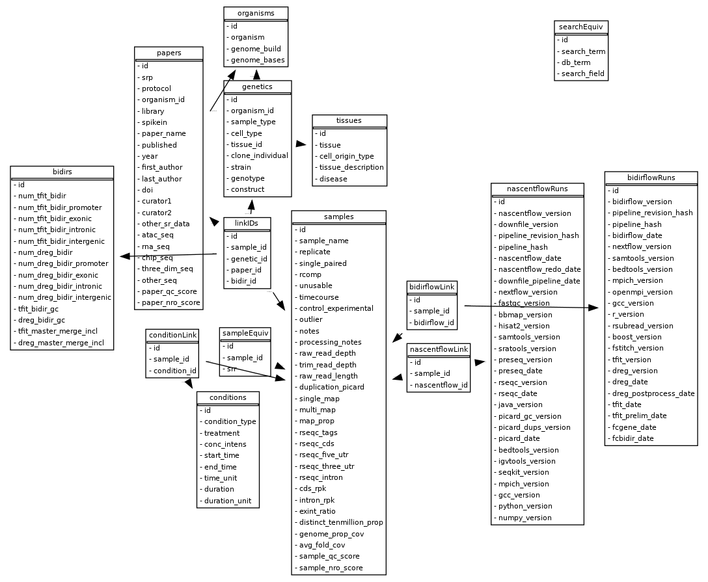

# DBNascent_build
## Version 1.1

This repository is intended for building, updating, and querying DBNascent. This is a MySQL database cataloguing all nascent sequencing experiments in the SRA through 2020. The database has been built and maintained by the DnA Lab at University of Colorado Boulder.

Data in the database pulls from manually curated metadata tables, quality control data, and bidirectional call data from samples. All data is present on the Fiji cluster at CU Boulder.

## Dependencies

The database was built with python 3.6.3. The following packages are required:

configparser	v5.2.0 or higher 
numpy		v1.19.2 or higher 
yaml		v5.4.1 or higher 
pymysql		v1.0.2 or higher (may substitute a different MySQL translator) 
sqlalchemy	v1.4.31 or higher 

## Database schema

 
(Generated with https://github.com/sqlalchemy/sqlalchemy/wiki/SchemaDisplay)

## Usage

All database objects and functions are defined in dborm.py and dbutils.py.

Building and maintaining DBNascent:

config_build.py defines file paths and fields outside of and within the database. Adding a field to a metadata table requires adding it to the config_build.py file as well.
organisms.txt and searcheq.txt are manually curated tables defining organisms and unique values within the database. Adding data may require adding additional lines to these files.

The main scripts for building the database are db_global_add_update.py and db_paper_add_update.py, combined in the db_build_full.sbatch script.

The database can be queried with defined fields and filtering specifications with query_printout.py for input into DESeq2 or other applications. This script relies on the config_query.txt config file, as well as the dborm and dbutils.

Both config files refer to a credentials file that contains your credentials for accessing the database. This file should have the following six lines:

[client]
database = dbnascent
host = socotra.int.colorado.edu
user = <username>
password = <password>
default-character-set = utf8
